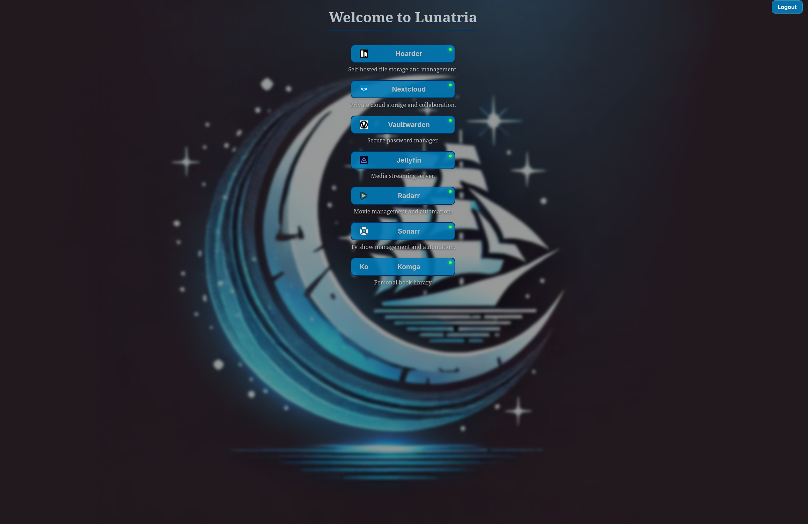

# Lunatria SSO

A SSO that doesn't require support from the services it's covering. Combines nginx and a custom built backend to provide convenience for users. It's not built for a additional security layer. It's built for convience. Rather than requiring services to support OAuth/SAML, Lunatria adapts to each service's auth method: cookies for Radarr/Sonarr, tokens in local storage for Jellyfin.

> **Status:** Supports Jellyfin both web and mobile, sonarr and radarr web.

> **Current Problems:** Not enough supported services, too much hardcoded elements.


<p align="center">
  <a href="https://lunatria.xyz"><strong>▶ Try the live demo → </strong></a>
</p>

<p align="center">
  <strong>Username:lunatria-demo (This user is a admin)    Password: Y8x0nm5VDfATDH</strong>
</p>



# Why I built this

After adding multiple services I noticed the inconvience especiaslly for my friends and family, thinking about what subdomain for this app, what for that app and saving multiple passwords. I looked at already built SSO's but they all relied on the app/serivice already supporting them. So I decided to build my own. 

## Features

- 1 password for 3 services (Jellyfin, Radarr, Sonarr)
- Admin dashboard to manage users, roles, and service access
- Live service status page showing which services are online
- Secure credential storage with AES-256 encryption
- Mobile app support (Jellyfin app on Android)

## How it works

Lunatria sits between the user and each service and adapts to the auth model each service expects.

### Web

- **Radarr and Sonarr** use cookie-based auth. If a user visits a service subdomain like `radarr.lunatria.com` without a valid `radarr_auth=true` cookie, the request is sent to the backend `/radarr` API.
- If the user has an active Lunatria session, the `/radarr` API returns the service cookie it receives from Radarr or Sonarr, along with `radarr_auth=true`.
- If the user does not have an active Lunatria session, the `/radarr` API redirects them to `lunatria.com` to log in.
- Once the `radarr_auth=true` cookie exists, requests go directly to Radarr or Sonarr.

### Jellyfin

- Jellyfin works differently because it uses tokens instead of cookies.
- When the `/jellyfin` API sees an active Lunatria session, it redirects to `jellyfin.lunatria.com/jellyfin-login-bridge.html`.
- `jellyfin-login-bridge.html` fetches the Jellyfin token, stores it in local storage, and then redirects the user to Jellyfin.
- It also sets a `jellyfin_auth=true` cookie so normal web traffic goes directly to Jellyfin.

### App

- Jellyfin app traffic is identified by the user agent. If the request looks like it came from Ktor or Android WebView, Lunatria treats it as app traffic.
- App requests go directly to Jellyfin except for `/Users/authenticatebyname`, which is the authentication endpoint.
- The user enters their SSO credentials into the Jellyfin app, Lunatria intercepts the request, and responds in the Jellyfin auth format using the stored credentials.

## Prerequisites

- **Node.js 20+** (developed against Node 20)
- **Docker and Docker Compose** installed
- **Nginx** installed
## Quick Run

```bash
# 1. Install dependencies
cd apps/backend
npm install
cd ... 
cd apps/frontend 
npm install

# 2. Create your local env file (defaults work out of the box)
cp .env.example .env

# 3. Initialize the database (creates tables + seeds the default user/equipment)
cd apps/backend
docker compose up -d
```


**4. Start the app:**

```bash
npm run start:backend
npm run start:frontend
```

Then open **http://localhost:4200**.

> Sidenote: In order to use the SSO features Lunatria MUST be running behind https
## Full Setup

In order to fully utilize all the SSO features more steps have to be taken. 

- Install your services (Jellyfin, Radarr, Sonarr)
- Create initial admin account for Jellyfin, and create the accounts for Radarr and Sonarr
- Install nginx
- Install something for https certificates eg. CertBot
- To your nginx copy and add the configs in [infra/nginx](infra/nginx), remember about editing the variables
- Add nginx configs for api.domain.com for the backend and domain.com for the frontend
- Add https certificates to all 5 domains
- Create and fill out a .env, you can just copy .env.example and change the variables
- Create an initial administrator account using the [create-admin script](apps/backend/scripts/create-admin.ts): `npx ts-node apps/backend/scripts/create-admin.ts`
- Enjoy


## Available scripts

| Command | Description |
| --- | --- |
| `npm run start:backend:dev` | starts the backend in development mode |
| `npm run start:frontend`    | starts the frontend                    |
| `npm run build:frontend`     | builds the frontend                    |
| `npm run build:backend`     | builds the backend                     |  


## Project layout

- `app/backend` — the backend is located here
- `apps/frontend` — the frontend is located here
- `apps/backend/scripts` — migration scripts and admin creation script
- `infra/nginx` — example nginx configs used 

