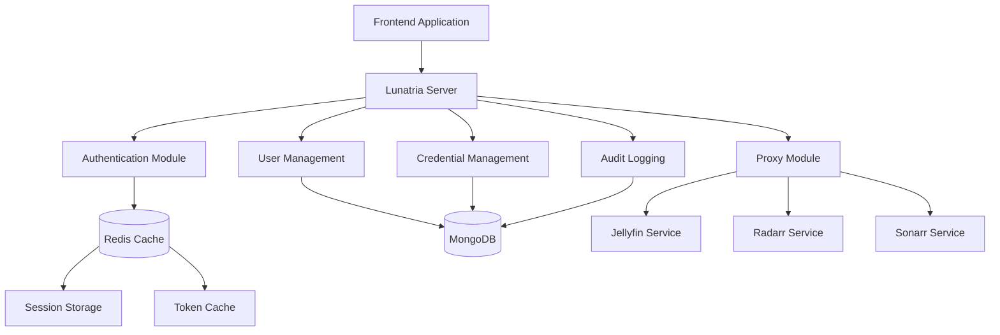
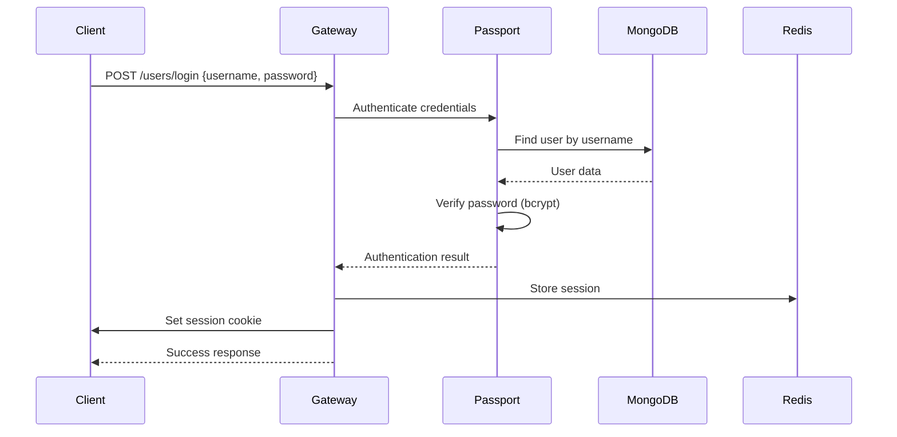
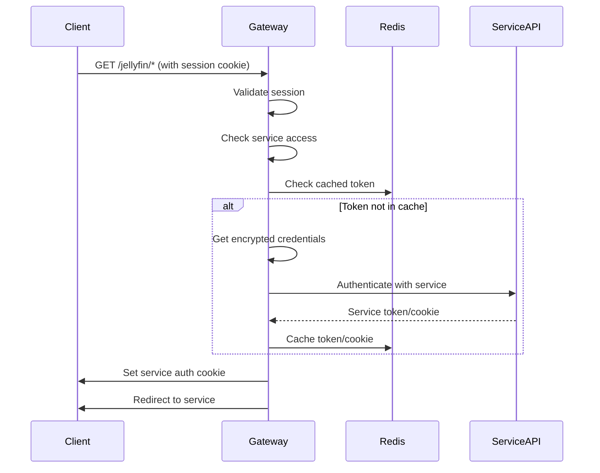

# Lunatria Server - Comprehensive API Documentation

## Table of Contents
1. [Project Overview](#project-overview)
2. [Architecture Overview](#architecture-overview)
3. [Backend API Reference](#backend-api-reference)
4. [Data Models](#data-models)
5. [Authentication Flow](#authentication-flow)
6. [Service Integration](#service-integration)
7. [Development Guide](#development-guide)
8. [Environment Configuration](#environment-configuration)
9. [Security Best Practices](#security-best-practices)

---

## Project Overview

Lunatria Server is a NestJS-based authentication proxy service that provides secure Single Sign-On (SSO) access to media services including Jellyfin, Radarr, and Sonarr. It acts as a centralized gateway with user management, credential encryption, session management, and comprehensive audit logging.

### Key Features
- **SSO Authentication**: Centralized login for multiple media services
- **Service Proxy**: Secure proxying to backend media services
- **Credential Encryption**: AES-256-CBC encryption for stored credentials
- **Session Management**: Redis-based session storage with automatic expiry
- **Audit Logging**: Comprehensive logging of all service interactions
- **Role-Based Access**: Admin and user roles with service-specific permissions
- **Cross-Domain Cookies**: Support for subdomain-based SSO

### Technology Stack
- **Framework**: NestJS 10.0.0+
- **Database**: MongoDB (via Mongoose)
- **Cache/Sessions**: Redis
- **Authentication**: Passport.js (Local Strategy)
- **Encryption**: Node.js Crypto (AES-256-CBC)
- **Environment**: TypeScript, Docker

---

## Architecture Overview



### Core Components

1. **Authentication Layer**: Passport.js-based authentication with session management
2. **Proxy Layer**: Service-specific proxy controllers for media applications
3. **Data Layer**: MongoDB for persistent data, Redis for caching and sessions
4. **Security Layer**: Encrypted credential storage and audit logging
5. **Access Control**: Role-based and service-specific access control

---

## Backend API Reference

### Base URL
```
Production: https://auth.lunatria.com
Development: http://localhost:3000
```

### Response Format
All API responses follow a consistent format with custom response codes:

```json
{
  "statusCode": 200,
  "responseCode": 609,
  "data": {
    "User": "username"
  }
}
```

### Error Handling
Errors use custom response codes for detailed client-side handling:

```json
{
  "statusCode": 401,
  "responseCode": 603
}
```

### API Endpoints

#### Authentication Endpoints

##### POST `/users/login`
Authenticate user and create session.

**Request Body:**
```json
{
  "username": "string",
  "password": "string"
}
```

**Response:**
```json
{
  "statusCode": 200,
  "responseCode": 609,
  "data": {
    "User": "username"
  }
}
```

**Error Codes:**
- `602` (401): Incorrect username
- `603` (401): Incorrect password
- `610` (404): User not found

##### GET `/users/logout`
Destroy user session and clear cookies.

**Response:**
```json
{
  "message": "Logged out"
}
```

##### GET `/users/logout-jellyfin`
Logout from Jellyfin service specifically.

**Response:**
```json
{
  "message": "Logged out"
}
```

##### GET `/users/logout-radarr`
Logout from Radarr service specifically.

**Response:**
```json
{
  "message": "Logged out"
}
```

##### GET `/users/logout-sonarr`
Logout from Sonarr service specifically.

**Response:**
```json
{
  "message": "Logged out"
}
```

#### User Management Endpoints

##### POST `/users/register` 🔒 Admin Only
Create a new user account.

**Request Body:**
```json
{
  "username": "string",
  "password": "string",
  "email": "string",
  "usertype": "admin" | "user",
  "allowedServices": ["jellyfin", "radarr", "sonarr"]
}
```

**Response:**
```json
{
  "userName": "string"
}
```

**Error Codes:**
- `607` (409): Username already exists
- `618` (401): Admin access required

##### DELETE `/users/delete-user`
Delete user account (self-deletion).

**Request Body:**
```json
{
  "username": "string",
  "password": "string"
}
```

**Response Code:** `617` (200): User deleted successfully

##### DELETE `/users/destroyallsessions` 🔒 Authenticated
Destroy all sessions for current user.

**Response Code:** `703` (200): All sessions destroyed

##### GET `/users/getallsessions` 🔒 Authenticated
Get all active sessions for current user.

**Response:**
```json
{
  "statusCode": 200,
  "responseCode": 701,
  "data": ["session1", "session2"]
}
```

#### Session Management Endpoints

##### GET `/sessions/issessionactive`
Check if current session is active.

**Response:**
```json
{
  "statusCode": 200,
  "responseCode": 704,
  "data": true
}
```

##### GET `/sessions/getuserinfo` 🔒 Authenticated
Get current user information.

**Response:**
```json
{
  "statusCode": 200,
  "responseCode": 705,
  "data": {
    "username": "string"
  }
}
```

#### Credential Management Endpoints

##### POST `/credentials/add` 🔒 Admin Only
Add service credentials for a user.

**Request Body:**
```json
{
  "targetUser": "string",
  "service": "jellyfin" | "radarr" | "sonarr",
  "username": "string",
  "password": "string"
}
```

**Error Codes:**
- `801` (409): Credentials already exist
- `610` (404): User not found

##### GET `/credentials/:service` 🔒 Authenticated
Get credentials for a specific service.

##### PATCH `/credentials/:service` 🔒 Authenticated
Update credentials for a specific service.

##### DELETE `/credentials/:service` 🔒 Authenticated
Delete credentials for a specific service.

#### Support Endpoints

##### GET `/support/services`
Get status of all services (public endpoint).

**Response:**
```json
{
  "jellyfin": true,
  "radarr": false,
  "sonarr": true,
  "hoarder": true,
  "nextcloud": true,
  "vaultwarden": true,
  "komga": true
}
```

##### GET `/support/service-access` 🔒 Authenticated
Check access to a specific service.

**Query Parameters:**
- `service`: Service name to check

**Response:**
```json
{
  "access": true
}
```

##### GET `/support/is-admin` 🔒 Admin Only
Check if current user is admin.

**Response:**
```json
{
  "isAdmin": true
}
```

#### Audit Endpoints

##### GET `/audit` 🔒 Admin Only
Get audit logs with optional filtering.

**Query Parameters:**
- `userId`: Filter by user ID
- `service`: Filter by service name
- `status`: Filter by status (success/fail)
- `limit`: Number of results (default: 100)

**Response:**
```json
[
  {
    "userId": "string",
    "service": "jellyfin",
    "status": "success",
    "reason": "Token generated",
    "path": "/auth",
    "createdAt": "2023-07-26T10:00:00.000Z"
  }
]
```

#### Proxy Endpoints

##### ALL `/jellyfin/*` 🔒 Service Access Required
Proxy requests to Jellyfin service.

**Requirements:**
- User must have 'jellyfin' in allowedServices
- Valid session required
- Service credentials must be configured

##### ALL `/radarr/*` 🔒 Service Access Required
Proxy requests to Radarr service.

**Requirements:**
- User must have 'radarr' in allowedServices
- Valid session required
- Service credentials must be configured

##### ALL `/sonarr/*` 🔒 Service Access Required
Proxy requests to Sonarr service.

**Requirements:**
- User must have 'sonarr' in allowedServices
- Valid session required
- Service credentials must be configured

---

## Data Models

### User Schema
```typescript
interface User {
  _id: ObjectId;
  username: string;              // Unique username
  password: string;              // Bcrypt hashed password
  email: string;                 // User email
  userType: 'admin' | 'user';    // User role
  allowedServices: string[];     // Array of allowed service names
  createdAt: Date;               // Account creation date
}
```

**Validation Rules:**
- `username`: Required, unique
- `password`: Required, min 8 characters (hashed with bcrypt)
- `email`: Required, valid email format
- `userType`: Enum ['admin', 'user'], default 'user'
- `allowedServices`: Array of service names

**Indexes:**
- `username`: Unique index for fast lookups

### Credential Schema
```typescript
interface Credential {
  userId: string;                // Reference to user
  service: string;               // Service name (jellyfin, radarr, sonarr)
  encryptedPayload: string;      // AES-256-CBC encrypted credential data
  createdAt: Date;               // Timestamp
  updatedAt: Date;               // Timestamp
}
```

**Encrypted Payload Contains:**
```json
{
  "username": "service_username",
  "password": "service_password"
}
```

**Security:**
- All credentials encrypted using AES-256-CBC
- Encryption key from `CREDENTIAL_ENCRYPTION_KEY` environment variable
- Each record uses unique IV (Initialization Vector)

### Audit Log Schema
```typescript
interface AuditLog {
  userId: string;                      // User who performed action
  service: string;                     // Service accessed
  status: 'success' | 'fail';          // Operation result
  reason?: string;                     // Additional details
  path?: string;                       // Request path
  createdAt: Date;                     // Timestamp (auto-expires after 90 days)
}
```

**Indexes:**
- `userId + createdAt`: For user activity queries
- `service + createdAt`: For service-specific queries
- TTL index: Auto-deletion after 90 days

### Redis Data Structures

#### Session Storage
```
Key: sess:${sessionId}
Value: Serialized session data
TTL: 30 days
```

#### User Sessions
```
Key: user:${userId}
Value: Set of session IDs
TTL: 30 days
```

#### Service Tokens
```
Key: jellyfin:token:${userId}
Value: JSON stringified token data
TTL: 24 hours
```

#### Service Cookies
```
Key: radarr:cookie:${userId}
Key: sonarr:cookie:${userId}
Value: Cookie string
TTL: 24 hours
```

---

## Authentication Flow

### Login Sequence Diagram



### Service Access Flow



### Session Management

1. **Session Creation**: 
   - Created on successful login
   - Stored in Redis with 30-day TTL
   - Cookie set with secure, sameSite='none' for cross-domain

2. **Session Validation**:
   - Middleware checks session on each request
   - Validates against Redis store
   - Automatic TTL renewal on activity

3. **Session Termination**:
   - Manual logout removes session from Redis
   - Service-specific logout clears cached tokens
   - Automatic expiry after 30 days of inactivity

---

## Service Integration

### Frontend Integration Guide

#### Authentication Setup
```javascript
// Configure axios for credential inclusion
axios.defaults.withCredentials = true;
axios.defaults.baseURL = 'https://auth.lunatria.com';

// Login function
async function login(username, password) {
  try {
    const response = await axios.post('/users/login', {
      username,
      password
    });
    return response.data;
  } catch (error) {
    handleAuthError(error.response.data.responseCode);
  }
}
```

#### Session Management
```javascript
// Check session status
async function checkSession() {
  try {
    const response = await axios.get('/sessions/issessionactive');
    return response.data.data; // true/false
  } catch (error) {
    return false;
  }
}

// Get user info
async function getUserInfo() {
  const response = await axios.get('/sessions/getuserinfo');
  return response.data.data;
}
```

#### Service Access
```javascript
// Check service access
async function checkServiceAccess(serviceName) {
  const response = await axios.get('/support/service-access', {
    params: { service: serviceName }
  });
  return response.data.access;
}

// Access service (will redirect if needed)
function accessService(serviceName) {
  window.location.href = `https://auth.lunatria.com/${serviceName}/`;
}
```

#### Error Handling
```javascript
const ERROR_CODES = {
  602: 'Invalid username',
  603: 'Invalid password',
  607: 'Username already exists',
  610: 'User not found',
  618: 'Admin access required',
  619: 'Service access denied',
  702: 'Session expired',
  801: 'Credentials already exist'
};

function handleAuthError(responseCode) {
  const message = ERROR_CODES[responseCode] || 'Unknown error';
  console.error('Auth Error:', message);
  // Handle error in UI
}
```

### Cookie Handling

#### Domain Configuration
- **Main Domain**: `.lunatria.com`
- **Secure**: `true` (HTTPS only)
- **SameSite**: `none` (Cross-domain support)
- **HttpOnly**: `true` (XSS protection)

#### Cookie Types
1. **Session Cookie**: `LunatriaSession` - Main authentication
2. **Service Cookies**: `jellyfin_auth`, `radarr_auth`, `sonarr_auth` - Service indicators
3. **Service Auth Cookies**: Set by individual services after proxy authentication

### CORS Configuration
```javascript
// Allowed origins pattern
const allowedOrigins = [
  'https://lunatria.com',
  'https://*.lunatria.com'
];

// Credentials always included
credentials: true
```

### SSO Bridge Implementation

For Jellyfin, a special SSO bridge handles token injection:

```html
<!-- sso-bridge.html -->
<script>
  const params = new URLSearchParams(window.location.search);
  const token = params.get('token');
  const userId = params.get('userId');
  const serverId = params.get('serverId');
  
  // Store credentials in localStorage
  const jellyfinCredentials = {
    Servers: [{
      AccessToken: token,
      UserId: userId,
      Id: serverId,
      // ... other config
    }]
  };
  
  localStorage.setItem('jellyfin_credentials', JSON.stringify(jellyfinCredentials));
  window.location.href = '/web/index.html';
</script>
```

---

## Development Guide

### Adding New Services

#### 1. Create Service Module
```bash
# Create service directory
mkdir src/proxy/newservice
cd src/proxy/newservice

# Create required files
touch newservice.controller.ts
touch newservice.service.ts
```

#### 2. Implement Service
```typescript
// newservice.service.ts
@Injectable()
export class NewServiceService {
  constructor(
    private readonly credentialsService: CredentialsService,
    private readonly auditService: AuditService,
  ) {}

  async getNewServiceToken(userId: string): Promise<string> {
    const redisKey = `newservice:token:${userId}`;
    const cached = await this.redis.get(redisKey);
    
    if (cached) {
      await this.auditService.log(userId, 'newservice', 'success', 'Using cached token', '/auth');
      return cached;
    }

    const creds = await this.credentialsService.getCredential(userId, 'newservice');
    // Implement service-specific authentication
    // Cache result
    // Log audit trail
    
    return token;
  }
}
```

#### 3. Create Controller
```typescript
// newservice.controller.ts
@Controller('/newservice')
export class NewServiceController {
  constructor(private readonly newServiceService: NewServiceService) {}

  @Service('newservice')
  @UseGuards(ServiceAccessGuard)
  @All('*')
  async proxy(@Req() req: any, @Res() res: Response) {
    const userId = req.session.passport.user;
    
    if (!req.cookies.newservice_auth) {
      const token = await this.newServiceService.getNewServiceToken(userId);
      
      // Set auth cookie
      res.cookie('newservice_auth', 'true', {
        httpOnly: true,
        secure: true,
        sameSite: 'none',
        maxAge: 1000 * 60 * 60 * 24,
        domain: process.env.DOMAIN,
        path: '/',
      });

      // Redirect to service
      return res.redirect(`https://newservice.${process.env.DOMAIN}`);
    }
  }
}
```

#### 4. Update Module Registration
```typescript
// proxy.module.ts
@Module({
  imports: [/* ... */],
  controllers: [
    // ... existing controllers
    NewServiceController,
  ],
  providers: [
    // ... existing services
    NewServiceService,
  ],
})
export class ProxyModule {}
```

#### 5. Update User Schema
```typescript
// Add to allowedServices enum validation
allowedServices: ['jellyfin', 'radarr', 'sonarr', 'newservice']
```

### Database Migrations

#### Creating Migrations
```bash
# Create migration file
touch migrations/001-add-new-field.ts
```

```typescript
// Migration structure
export async function up() {
  // Migration logic
  const db = mongoose.connection.db;
  await db.collection('users').updateMany(
    {},
    { $set: { newField: 'defaultValue' } }
  );
}

export async function down() {
  // Rollback logic
  const db = mongoose.connection.db;
  await db.collection('users').updateMany(
    {},
    { $unset: { newField: 1 } }
  );
}
```

#### Running Migrations
```bash
npx ts-node scripts/migration-runner.ts
```

### Testing

#### Unit Tests
```typescript
// Example test
describe('UsersService', () => {
  let service: UsersService;

  beforeEach(async () => {
    const module: TestingModule = await Test.createTestingModule({
      providers: [UsersService],
    }).compile();

    service = module.get<UsersService>(UsersService);
  });

  it('should create user', async () => {
    const result = await service.insertUser(/* ... */);
    expect(result).toBeDefined();
  });
});
```

#### Integration Tests
```bash
npm run test:e2e
```

### Development Workflow

#### Local Development Setup
```bash
# Install dependencies
npm install

# Start databases
docker-compose up -d

# Start development server
npm run start:dev

# Create admin user
npx ts-node scripts/create-admin.ts
```

#### Code Quality
```bash
# Linting
npm run lint

# Formatting
npm run format

# Type checking
npm run build
```

---

## Environment Configuration

### Required Environment Variables

```bash
# Database Configuration
MONGO_PORT=27018
MONGO_HOST=localhost
REDIS_PORT=6380
REDIS_URL=redis://127.0.0.1:6380

# Security
PASSPORT_SECRET=your-32-character-secret-key
CREDENTIAL_ENCRYPTION_KEY=your-32-character-encryption-key

# Domain Configuration
DOMAIN=.lunatria.com                    # Your domain (with dot for subdomain cookies)

# Service URLs
JELLYFIN_BASE_URL=http://192.168.33.36:8096    # Update with your Jellyfin server URL
RADARR_BASE_URL=http://192.168.33.36:7878      # Update with your Radarr server URL
SONARR_BASE_URL=http://192.168.33.36:8989      # Update with your Sonarr server URL
```

### Security Requirements

#### Encryption Key Generation
```bash
# Generate 32-character encryption key
node -e "console.log(require('crypto').randomBytes(16).toString('hex'))"
```

#### Session Secret Generation
```bash
# Generate session secret
node -e "console.log(require('crypto').randomBytes(32).toString('hex'))"
```

### Docker Configuration

```yaml
# docker-compose.yml
version: '3.8'
services:
  mongodb:
    image: mongo:latest
    ports:
      - "${MONGO_PORT}:27017"
    volumes:
      - mongo_data:/data/db
      
  redis:
    image: redis:alpine
    ports:
      - "${REDIS_PORT}:6379"
    volumes:
      - redis_data:/data
```

### Production Deployment

#### Environment Setup
```bash
# Production environment file
NODE_ENV=production
DOMAIN=.lunatria.com
MONGO_PORT=27017
REDIS_PORT=6379

# SSL Configuration
SSL_CERT_PATH=/path/to/cert.pem
SSL_KEY_PATH=/path/to/key.pem
```

#### Process Management
```bash
# Using PM2
npm install -g pm2
pm2 start dist/main.js --name lunatria-server

# Docker deployment
docker build -t lunatria-server .
docker run -d --env-file .env lunatria-server
```

---

## Security Best Practices

### Credential Handling

#### Encryption Implementation
```typescript
// AES-256-CBC encryption
export class EncryptionService {
  encrypt(json: any): string {
    const iv = crypto.randomBytes(16);
    const cipher = crypto.createCipheriv('aes-256-cbc', this.key, iv);
    const encrypted = Buffer.concat([
      cipher.update(JSON.stringify(json)),
      cipher.final(),
    ]);
    return iv.toString('hex') + ':' + encrypted.toString('hex');
  }
}
```

#### Best Practices
1. **Never store plaintext passwords**
2. **Use unique IV for each encryption**
3. **Rotate encryption keys regularly**
4. **Implement credential access logging**

### Session Security

#### Configuration
```typescript
// Secure session configuration
session({
  name: 'LunatriaSession',
  secret: process.env.PASSPORT_SECRET,
  resave: false,
  saveUninitialized: false,
  cookie: {
    httpOnly: true,        // Prevent XSS
    secure: true,          // HTTPS only
    sameSite: 'none',      // Cross-domain support
    maxAge: 30 * 24 * 60 * 60 * 1000  // 30 days
  }
})
```

#### Session Validation
```typescript
// Custom session validation
async canActivate(context: ExecutionContext) {
  const request = context.switchToHttp().getRequest();
  const session = request.session;
  
  // Validate session exists and is active
  await this.sessionsService.sessionErrorChecking(session);
  
  return request.isAuthenticated();
}
```

### Access Control

#### Role-Based Access
```typescript
// Admin guard implementation
@Injectable()
export class AdminGuard implements CanActivate {
  async canActivate(context: ExecutionContext) {
    const request = context.switchToHttp().getRequest();
    const user = await this.userService.getUserById(request.session.passport.user);
    
    if (user.userType !== 'admin') {
      throwException.OnlyForAdmin();
    }
    
    return true;
  }
}
```

#### Service-Based Access
```typescript
// Service access control
@Injectable()
export class ServiceAccessGuard implements CanActivate {
  async canActivate(context: ExecutionContext) {
    const serviceName = this.reflector.get<string>('service', context.getHandler());
    const user = await this.getUserFromSession(context);
    
    // Admins bypass service restrictions
    if (user.userType === 'admin') return true;
    
    // Check if user has access to service
    if (!user.allowedServices.includes(serviceName)) {
      throwException.NoServiceAccess();
    }
    
    return true;
  }
}
```

### Audit Logging

#### Implementation
```typescript
// Comprehensive audit logging
async log(
  userId: string,
  service: string,
  status: 'success' | 'fail',
  reason?: string,
  path?: string,
) {
  await this.auditModel.create({
    userId,
    service,
    status,
    reason,
    path,
    createdAt: new Date()
  });
}
```

#### Usage Pattern
```typescript
// Log all service interactions
try {
  const token = await this.authenticateWithService(creds);
  await this.auditService.log(userId, 'jellyfin', 'success', 'Token generated', '/auth');
  return token;
} catch (error) {
  await this.auditService.log(userId, 'jellyfin', 'fail', error.message, '/auth');
  throw error;
}
```

### Input Validation

#### DTO Validation
```typescript
// Use class-validator for input validation
export class LoginDto {
  @IsString()
  @IsNotEmpty()
  username: string;

  @IsString()
  @MinLength(8)
  password: string;
}
```

#### Custom Validation Pipeline
```typescript
// Custom validation with error codes
export const CustomValidationPipe = new ValidationPipe({
  exceptionFactory: (errors: ValidationError[]) => {
    return new BadRequestException({
      statusCode: 400,
      code: 870,
      errors: errors.map((err) => ({
        field: err.property,
        code: ERROR_CODES[Object.keys(err.constraints || {})[0]] || 999,
        issues: Object.values(err.constraints || {}),
      })),
    });
  },
});
```

### Network Security

#### CORS Configuration
```typescript
// Secure CORS setup
app.enableCors({
  origin: (origin, callback) => {
    if (!origin) return callback(null, true);
    
    const hostname = new URL(origin).hostname;
    if (hostname === domain || hostname.endsWith(domain)) {
      return callback(null, true);
    }
    
    return callback(new Error('Not allowed by CORS'));
  },
  credentials: true,
});
```

#### Rate Limiting
```typescript
// Implement rate limiting for sensitive endpoints
@UseGuards(ThrottlerGuard)
@Throttle(5, 60) // 5 requests per minute
@Post('/login')
async login() {
  // Login implementation
}
```

---

## API Schema Reference

### Authentication Schemas

```json
{
  "LoginRequest": {
    "type": "object",
    "required": ["username", "password"],
    "properties": {
      "username": {
        "type": "string",
        "minLength": 3,
        "maxLength": 50
      },
      "password": {
        "type": "string",
        "minLength": 8
      }
    }
  },
  "LoginResponse": {
    "type": "object",
    "properties": {
      "statusCode": {"type": "number"},
      "responseCode": {"type": "number"},
      "data": {
        "type": "object",
        "properties": {
          "User": {"type": "string"}
        }
      }
    }
  }
}
```

### User Management Schemas

```json
{
  "CreateUserRequest": {
    "type": "object",
    "required": ["username", "password", "email", "usertype"],
    "properties": {
      "username": {"type": "string"},
      "password": {"type": "string", "minLength": 8},
      "email": {"type": "string", "format": "email"},
      "usertype": {
        "type": "string",
        "enum": ["admin", "user"]
      },
      "allowedServices": {
        "type": "array",
        "items": {
          "type": "string",
          "enum": ["jellyfin", "radarr", "sonarr"]
        }
      }
    }
  },
  "UserResponse": {
    "type": "object",
    "properties": {
      "userName": {"type": "string"}
    }
  }
}
```

### Error Response Schema

```json
{
  "ErrorResponse": {
    "type": "object",
    "properties": {
      "statusCode": {"type": "number"},
      "responseCode": {"type": "number"},
      "message": {"type": "string"}
    }
  }
}
```

### Response Code Reference

| Code | Status | Description |
|------|--------|-------------|
| 601  | 422    | Email needs verification |
| 602  | 401    | Incorrect email/username |
| 603  | 401    | Incorrect password |
| 607  | 409    | Username already used |
| 609  | 200    | User logged in successfully |
| 610  | 404    | User not found |
| 617  | 200    | User deleted successfully |
| 618  | 401    | Admin access required |
| 619  | 401    | No service access |
| 701  | 200    | Sessions fetched successfully |
| 702  | 401    | Session not found |
| 703  | 200    | All sessions destroyed |
| 704  | 200    | Session status fetched |
| 705  | 200    | User info fetched |
| 801  | 409    | Credentials already exist |
| **Validation** |
| 870  | 400    | Validation error (see errors array) |
| 871  | 400    | Field is required |
| 872  | 400    | Field must be string |
| 877  | 400    | Field must be boolean |
| 878  | 400    | Field must be number |

---

This documentation provides comprehensive coverage of the Lunatria Server API, architecture, and development practices. It serves as both a reference for frontend developers integrating with the backend and a guide for backend developers maintaining and extending the system.

For additional questions or support, please refer to the audit logs for debugging or contact the development team.
