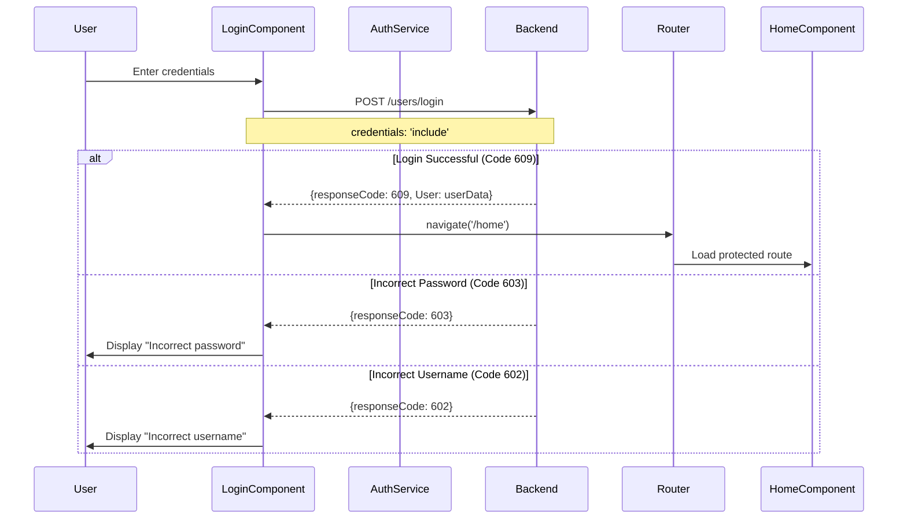
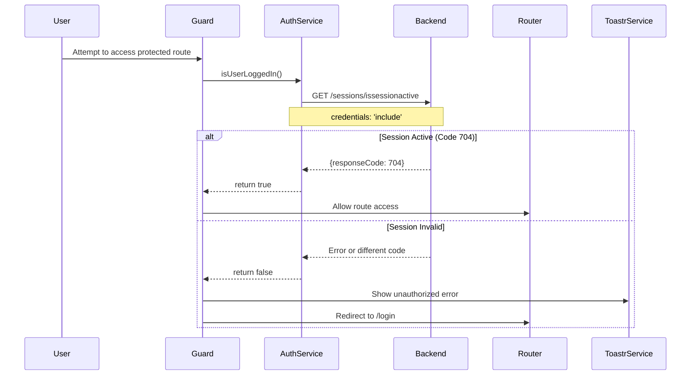
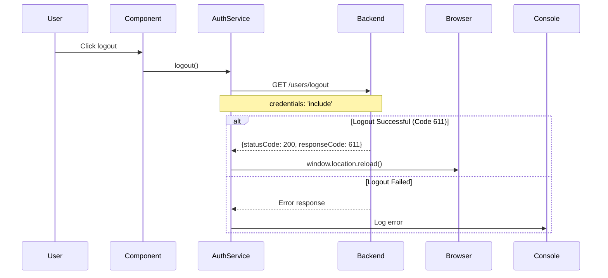
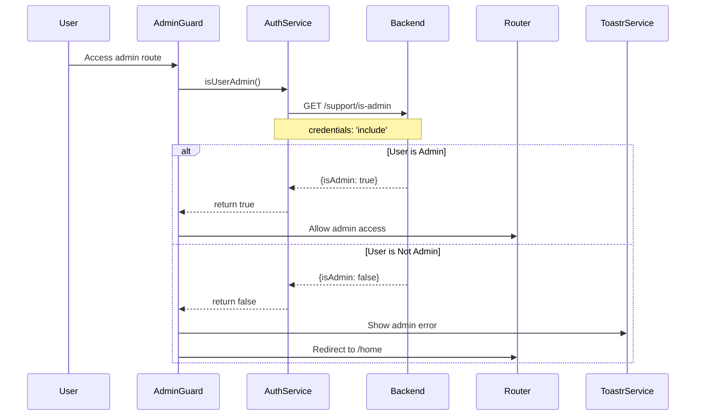

# Authentication System

## Overview

Lunatria implements a robust session-based authentication system using HTTP cookies with server-side session validation. The system provides secure user authentication, automatic session management, and role-based access control.

## Authentication Flow Diagrams

### Login Process



### Session Validation Process



### Logout Process



### Admin Authentication Flow



## Authentication Service Implementation

### Core Authentication Methods

```typescript
export class AuthService {
  /**
   * Validates current user session with backend
   * @returns Promise<boolean> - true if session is active
   */
  async isUserLoggedIn(): Promise<boolean> {
    try {
      const response = await fetch(`${environment.apiBaseUrl}/sessions/issessionactive`, {
        credentials: 'include',
      });

      if (!response.ok) {
        return false;
      }

      const data = await response.json();
      return data.responseCode === 704; // Active session code
    } catch (error) {
      console.error('Error checking session:', error);
      return false;
    }
  }

  /**
   * Checks if current user has admin privileges
   * @returns Promise<boolean> - true if user is admin
   */
  async isUserAdmin(): Promise<boolean> {
    try {
      const response = await fetch(`${environment.apiBaseUrl}/support/is-admin`, {
        credentials: 'include',
      }).then(response => response.json());
      
      return response.isAdmin !== false;
    } catch (error) {
      console.error('Error checking admin status:', error);
      return false;
    }
  }

  /**
   * Logs out current user and reloads page
   */
  logout(): void {
    fetch(`${environment.apiBaseUrl}/users/logout`, {
      method: 'GET',
      credentials: 'include'
    })
      .then(response => response.json())
      .then(data => {
        if (data.statusCode === 200 && data.responseCode === 611) {
          window.location.reload();
        } else {
          console.log('Logout failed');
        }
      })
      .catch(error => console.error('Logout error:', error));
  }
}
```

## Guard Implementation

### Authentication Guard

```typescript
export const authGuard: CanActivateFn = async () => {
  const authService = inject(AuthService);
  const router = inject(Router);
  const toastr = inject(ToastrService);

  try {
    const loggedIn = await authService.isUserLoggedIn();
    if (!loggedIn) {
      toastr.error('You must be logged in to access this page.', 'Unauthorized');
      router.navigate(['/login']);
    }
    return loggedIn;
  } catch (err) {
    toastr.error('You must be logged in to access this page.', 'Unauthorized');
    router.navigate(['/login']);
    return false;
  }
};
```

### Admin Guard

```typescript
export const adminGuard: CanActivateFn = async () => {
  const authService = inject(AuthService);
  const router = inject(Router);
  const toastr = inject(ToastrService);

  try {
    const isUserAdmin = await authService.isUserAdmin();
    if (!isUserAdmin) {
      toastr.error('You must be an admin to access this page.', 'Unauthorized');
      router.navigate(['/home']);
    }
    return isUserAdmin;
  } catch (err) {
    toastr.error('You must be logged in to access this page.', 'Unauthorized');
    router.navigate(['/home']);
    return false;
  }
};
```

## Session Management

### Cookie-Based Sessions

The authentication system uses HTTP cookies for session management:

- **Secure Transport**: All API calls include `credentials: 'include'`
- **Server-Side Validation**: Sessions are validated on the backend
- **Automatic Cleanup**: Sessions are properly cleaned up on logout
- **Cross-Domain Support**: Configured for development and production domains

### Session Lifecycle

1. **Session Creation**: Created on successful login (response code 609)
2. **Session Validation**: Continuously validated via `/sessions/issessionactive`
3. **Session Refresh**: Automatically maintained during active use
4. **Session Destruction**: Explicitly destroyed on logout (response code 611)

## Response Codes

The authentication system uses custom response codes for different scenarios:

### Login Response Codes
- **609**: Login successful
- **602**: Incorrect username
- **603**: Incorrect password

### Session Response Codes
- **704**: Active session confirmed
- **611**: Logout successful

### Admin Response Codes
- **isAdmin: true**: User has admin privileges
- **isAdmin: false**: User does not have admin privileges

## Error Handling

### Authentication Errors

```typescript
// Login component error handling
.then(data => {
  if (data.responseCode === 609) {
    // Success - redirect to home
    this.router.navigate(['/home']);
  } else if (data.responseCode === 603) {
    alert('Incorrect password');
  } else if (data.responseCode === 602) {
    alert('Incorrect username');
  } else {
    console.log('Unknown response code:', data.responseCode);
  }
})
.catch(error => console.error('Error:', error));
```

### Guard Error Handling

Guards automatically handle authentication errors by:
- Displaying appropriate toast notifications
- Redirecting to appropriate pages (`/login` for auth, `/home` for admin)
- Logging errors for debugging purposes

## Security Features

### Protection Mechanisms

1. **Route Protection**: All sensitive routes protected by guards
2. **Session Validation**: Continuous session checking
3. **Role-Based Access**: Separate admin and user access levels
4. **Secure Communication**: HTTPS enforcement and credential inclusion
5. **Error Boundaries**: Comprehensive error handling and user feedback

### Best Practices Implemented

- **No Client-Side Token Storage**: Relies on HTTP-only cookies
- **Server-Side Session Validation**: All session checks go through backend
- **Automatic Redirects**: Seamless user experience on auth failures
- **Clear Error Messages**: User-friendly error notifications
- **Fail-Safe Defaults**: Authentication failures default to denied access

## Integration Points

### Component Integration

Components integrate with authentication through:
- **Direct Service Injection**: Using `AuthService` for auth operations
- **Route Protection**: Automatic guard-based protection
- **Toast Notifications**: User feedback on auth operations
- **Navigation Control**: Automatic redirects based on auth state

### API Integration

Authentication integrates with the backend API through:
- **Standard HTTP Methods**: GET for checks, POST for login
- **Consistent Error Handling**: Standard response code patterns
- **Cookie Management**: Automatic cookie handling by the browser
- **Environment Configuration**: Environment-specific API endpoints
