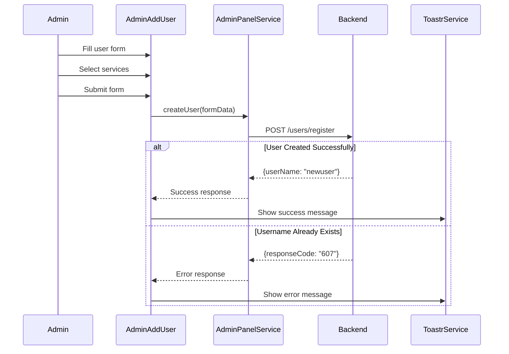
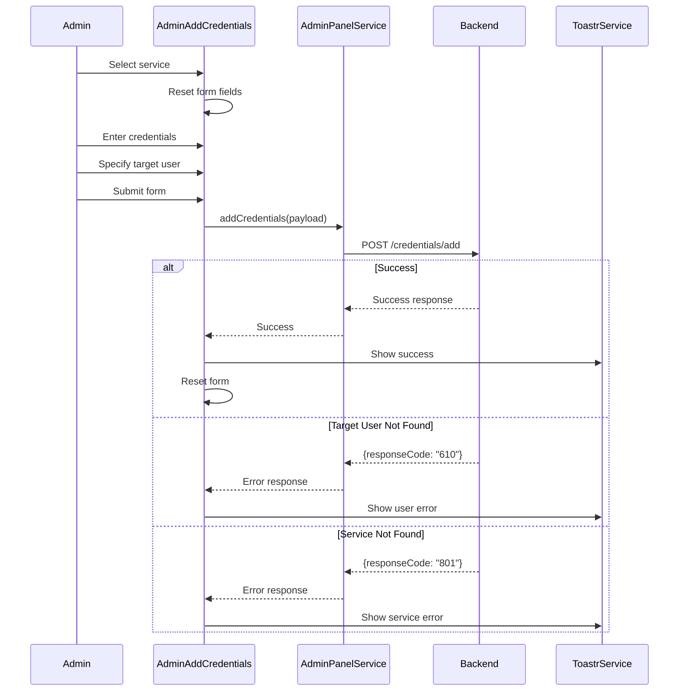

# Admin Panel Features

## Overview

The Lunatria admin panel provides comprehensive administrative capabilities for user management, credential assignment, and service configuration. Built with role-based access control, it offers a tabbed interface for different administrative functions.

## Admin Panel Architecture

```
┌─────────────────────────────────────────────────────────────┐
│                    ADMIN PANEL COMPONENT                    │
├─────────────────────────────────────────────────────────────┤
│                                                             │
│  ┌─────────────────┐  ┌─────────────────┐  ┌─────────────┐ │
│  │   ADD USER      │  │  CREDENTIALS    │  │   ACCESS    │ │
│  │     TAB         │  │      TAB        │  │    TAB      │ │
│  │                 │  │                 │  │             │ │
│  │ • User Creation │  │ • Service Creds │  │ • Future    │ │
│  │ • Service Perms │  │ • User Target   │  │   Features  │ │
│  │ • User Types    │  │ • Email/Pass    │  │             │ │
│  └─────────────────┘  └─────────────────┘  └─────────────┘ │
│                                                             │
├─────────────────────────────────────────────────────────────┤
│                    SHARED COMPONENTS                        │
│  • BackgroundComponent                                     │
│  • FooterComponent                                         │
└─────────────────────────────────────────────────────────────┘
```

## Access Control

### Admin Guard Protection

The admin panel is protected by the `adminGuard` which ensures:

1. **User Authentication**: Validates active user session
2. **Admin Privileges**: Verifies admin role through `/support/is-admin` endpoint
3. **Automatic Redirection**: Redirects non-admin users to home page
4. **Error Handling**: Provides clear feedback for access denials

```typescript
// Route protection in app.routes.ts
{ 
  path: 'admin-panel', 
  component: AdminPanelComponent, 
  canActivate: [adminGuard] 
}
```

### Permission Validation

```typescript
// AdminGuard implementation
export const adminGuard: CanActivateFn = async () => {
  const authService = inject(AuthService);
  const router = inject(Router);
  const toastr = inject(ToastrService);

  try {
    const isUserAdmin = await authService.isUserAdmin();
    if (!isUserAdmin) {
      toastr.error('You must be an admin to access this page.', 'Unauthorized');
      router.navigate(['/home']);
    }
    return isUserAdmin;
  } catch (err) {
    toastr.error('You must be logged in to access this page.', 'Unauthorized');
    router.navigate(['/home']);
    return false;
  }
};
```

## Main Admin Panel Component

### Component Structure

```typescript
@Component({
  selector: 'app-admin-panel',
  templateUrl: './admin-panel.component.html',
  styleUrls: ['./admin-panel.component.css'],
  imports: [
    FooterComponent, 
    BackgroundComponent, 
    NgIf, 
    CommonModule, 
    AdminAddUserComponent, 
    AdminAddCredentialsComponent
  ],
  standalone: true
})
export class AdminPanelComponent {
  selectedSection: 'add-user' | 'credentials' | 'access' = 'add-user';

  selectSection(section: 'add-user' | 'credentials' | 'access') {
    this.selectedSection = section;
  }
}
```

### Navigation System

The admin panel uses a tabbed interface for organizing different administrative functions:

- **Add User Tab**: User creation and permission management
- **Credentials Tab**: Service credential assignment
- **Access Tab**: Future access control features

```html
<!-- Tab navigation example -->
<div class="tab-navigation">
  <button 
    [class.active]="selectedSection === 'add-user'"
    (click)="selectSection('add-user')">
    Add User
  </button>
  
  <button 
    [class.active]="selectedSection === 'credentials'"
    (click)="selectSection('credentials')">
    Manage Credentials
  </button>
  
  <button 
    [class.active]="selectedSection === 'access'"
    (click)="selectSection('access')">
    Access Control
  </button>
</div>
```

## User Management Features

### Add User Component

The `AdminAddUserComponent` handles new user creation with comprehensive service permissions.

#### Component Implementation

```typescript
@Component({
  selector: 'app-admin-add-user',
  templateUrl: './admin-add-user.component.html',
  styleUrls: ['./admin-add-user.component.css'],
  imports: [FormsModule]
})
export class AdminAddUserComponent {
  // Form properties
  username = '';
  password = '';
  email = '';
  usertype = '';
  
  // Service permissions
  allowedServices = {
    jellyfin: false,
    nextcloud: false,
    radarr: false,
    sonarr: false
  };
  
  availableServices = ['jellyfin', 'radarr', 'sonarr', 'nextcloud'];

  constructor(
    private adminService: AdminPanelService,
    private toastr: ToastrService
  ) { }

  async onSubmit() {
    const selectedServices = Object.keys(this.allowedServices)
      .filter(service => this.allowedServices[service as keyof typeof this.allowedServices]);
      
    const formData = {
      username: this.username,
      password: this.password,
      email: this.email,
      usertype: this.usertype,
      allowedServices: selectedServices
    };

    const response = await this.adminService.createUser(formData);
    
    if (response.userName === this.username) {
      this.toastr.success(`User "${response.userName}" created successfully`);
      return;
    }
    
    if (response.responseCode === '607') {
      this.toastr.error('Username already exists');
    }
  }
}
```

#### Key Features

**User Information Management**:
- Username and password creation
- Email address assignment
- User type specification
- Validation and error handling

**Service Permission System**:
- Multi-service permission checkboxes
- Dynamic service selection
- Service-specific access control
- Granular permission management

**Form Validation**:
- Required field validation
- Username uniqueness checking
- Email format validation
- Password strength requirements

**Response Handling**:
- Success notifications with user confirmation
- Error handling for duplicate usernames (Code 607)
- Clear user feedback through toast notifications

### Supported Services

| Service | Purpose | Permission Type |
|---------|---------|-----------------|
| jellyfin | Media streaming server | Media access |
| nextcloud | File sharing platform | File storage |
| radarr | Movie collection manager | Media management |
| sonarr | TV series manager | Media management |

### User Creation Flow



## Credential Management Features

### Add Credentials Component

The `AdminAddCredentialsComponent` manages service-specific credentials for users.

#### Component Implementation

```typescript
@Component({
  selector: 'app-admin-add-credentials',
  templateUrl: './admin-add-credentials.component.html',
  styleUrls: ['./admin-add-credentials.component.css'],
  imports: [FormsModule, CommonModule]
})
export class AdminAddCredentialsComponent {
  selectedService: string = '';
  credentials: any = {
    username: '',
    password: '',
    email: '',
    targetUser: ''
  };

  constructor(
    private adminService: AdminPanelService,
    private toastr: ToastrService
  ) { }

  onServiceChange() {
    // Reset form when service changes
    this.credentials = {
      username: '',
      password: '',
      email: '',
      targetUser: ''
    };
  }

  serviceRequiresEmail(service: string): boolean {
    return ['nextcloud'].includes(service);
  }

  async onSubmit() {
    const payload = {
      service: this.selectedService,
      username: this.credentials.username,
      password: this.credentials.password,
      email: this.credentials.email,
      targetUser: this.credentials.targetUser
    };

    const response = await this.adminService.addCredentials(payload);

    if (response.responseCode === "610") {
      this.toastr.error('Target user not found.');
    } else if (response.responseCode === "801") {
      this.toastr.error('Service not found.');
    } else {
      this.toastr.success('Credentials added successfully.');
      this.onServiceChange(); // Reset form
    }
  }
}
```

#### Key Features

**Service-Specific Configuration**:
- Dynamic form fields based on selected service
- Service-specific validation requirements
- Email requirement detection for services like Nextcloud

**Credential Assignment**:
- Target user specification
- Service-specific username/password
- Optional email field for compatible services
- Secure credential storage

**Error Handling**:
- **Code 610**: Target user not found
- **Code 801**: Service not found
- Success confirmations with form reset

**Form Management**:
- Dynamic form reset on service change
- Conditional field display
- Input validation and sanitization

### Credential Management Flow



## Admin Panel Service Integration

### Service Methods

The `AdminPanelService` provides the backend integration for admin operations:

```typescript
// User creation
async createUser(userData: {
  username: string;
  password: string;
  email: string;
  usertype: string;
  allowedServices: string[];
})

// Credential management
async addCredentials(credentialsData: {
  service: string;
  username?: string;
  password: string;
  email?: string;
  targetUser: string;
})
```

### API Endpoints

| Operation | Method | Endpoint | Purpose |
|-----------|--------|----------|---------|
| Create User | POST | `/users/register` | Creates new user with permissions |
| Add Credentials | POST | `/credentials/add` | Assigns service credentials to user |
| Admin Check | GET | `/support/is-admin` | Validates admin privileges |

## Security Features

### Admin-Only Access

1. **Route Protection**: `adminGuard` prevents unauthorized access
2. **Session Validation**: Continuous admin privilege checking
3. **Secure Communication**: All API calls use `credentials: 'include'`
4. **Error Handling**: Secure error messages without information disclosure

### Data Protection

1. **Input Sanitization**: All form inputs are validated
2. **Credential Security**: Passwords handled securely through HTTPS
3. **User Isolation**: Credentials are user-specific and isolated
4. **Audit Trail**: Operations are logged for security monitoring

## User Experience Features

### Toast Notifications

Comprehensive feedback system:
- Success confirmations for all operations
- Clear error messages with specific codes
- User-friendly language and guidance
- Automatic message dismissal

### Form Management

- Dynamic form field display based on service selection
- Automatic form reset after successful operations
- Input validation with real-time feedback
- Consistent styling and layout

### Navigation

- Tabbed interface for logical separation
- Clear section indicators
- Smooth transitions between tabs
- Breadcrumb navigation support

## Future Extensibility

### Planned Features

1. **User Management**: Edit existing users, delete users, view user lists
2. **Bulk Operations**: Bulk user creation, bulk credential assignment
3. **Service Management**: Add/remove services, configure service settings
4. **Audit Logs**: View admin action history, user activity logs
5. **Permission Templates**: Predefined permission sets for common roles

### Extension Points

```typescript
// Future admin components
export type AdminSection = 
  | 'add-user' 
  | 'credentials' 
  | 'access'
  | 'user-management'     // Future: Edit/delete users
  | 'service-config'      // Future: Service configuration
  | 'audit-logs'          // Future: Activity monitoring
  | 'bulk-operations';    // Future: Bulk admin tasks
```

### API Extensibility

Future API endpoints:
- `GET /users/list` - User listing with pagination
- `PUT /users/{id}` - User modification
- `DELETE /users/{id}` - User deletion
- `GET /credentials/list` - Credential overview
- `GET /admin/audit-log` - Admin action history

## Best Practices

### Admin Development

1. **Security First**: Always validate admin privileges
2. **Clear Feedback**: Provide immediate user feedback
3. **Error Handling**: Handle all error scenarios gracefully
4. **Form Validation**: Validate both client and server-side
5. **Audit Trails**: Log all administrative actions

### User Experience

1. **Intuitive Interface**: Keep admin operations simple and clear
2. **Confirmation Dialogs**: Confirm destructive operations
3. **Progress Indicators**: Show progress for long operations
4. **Help Documentation**: Provide contextual help and guidance
5. **Keyboard Navigation**: Support keyboard-only navigation

### Testing Strategies

```typescript
describe('Admin Panel', () => {
  describe('User Creation', () => {
    it('should create user with selected services', () => {
      // Test user creation flow
    });

    it('should handle duplicate username error', () => {
      // Test error handling
    });
  });

  describe('Credential Management', () => {
    it('should assign credentials to target user', () => {
      // Test credential assignment
    });

    it('should handle invalid target user', () => {
      // Test error scenarios
    });
  });

  describe('Access Control', () => {
    it('should deny access to non-admin users', () => {
      // Test guard protection
    });
  });
});
```
